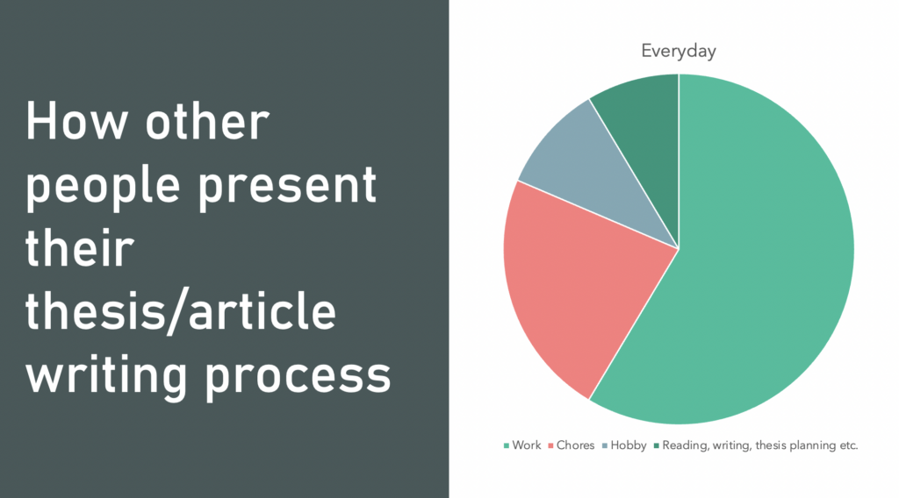
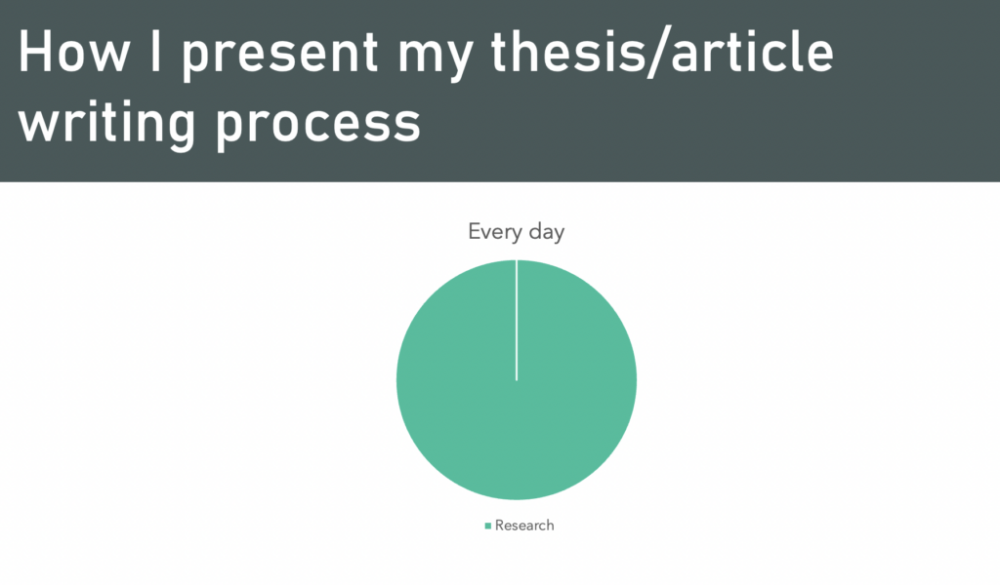
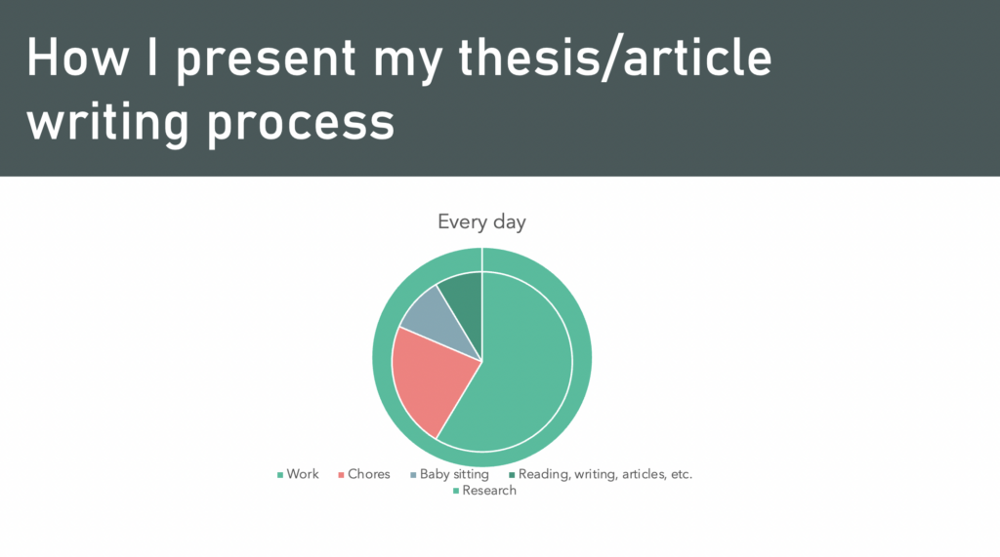

## How I wrote my thesis and felt happy about it

<!--truncate-->

In the past month, I submitted my thesis and felt happy and motivated to continue my research. However, it seems that many novice PhDs have a different experience. After submitting their dissertations, they often feel worn out and burnt out. Unfortunately, many never return to their research topic or revise their writing. To avoid this stressful outcome, I recommend making a lifestyle change.

When I suggest changing your lifestyle, I don't mean simply eating healthier or going out more often. Instead, I believe that making your research topic an integral part of your life can make the PhD writing process a more enjoyable experience.

Many novice doctors post various visual representations of their day. Most of these figures look like this.

Thesis/Research takes only a portion - no matter how large it may be it is still a portion - of their time. And it is not included in people's hobbies, to boot. I suggest a controversial approach.

Let me clarify that I'm not suggesting you should give up your life, isolate yourself at a desk, and write non-stop. What I mean is that incorporating activities related to your research topic into your daily routine can make the whole process more enjoyable and less overwhelming. This can include activities such as reading, attending lectures or conferences, engaging in discussions with peers or experts in your field, and staying up-to-date with the latest developments. By making your research topic a part of your lifestyle, you can approach your work with more enthusiasm and find joy in the process.

As soon as you incorporate research into your lifestyle, every writing, even the most effort-consuming one, will bring pleasure.
