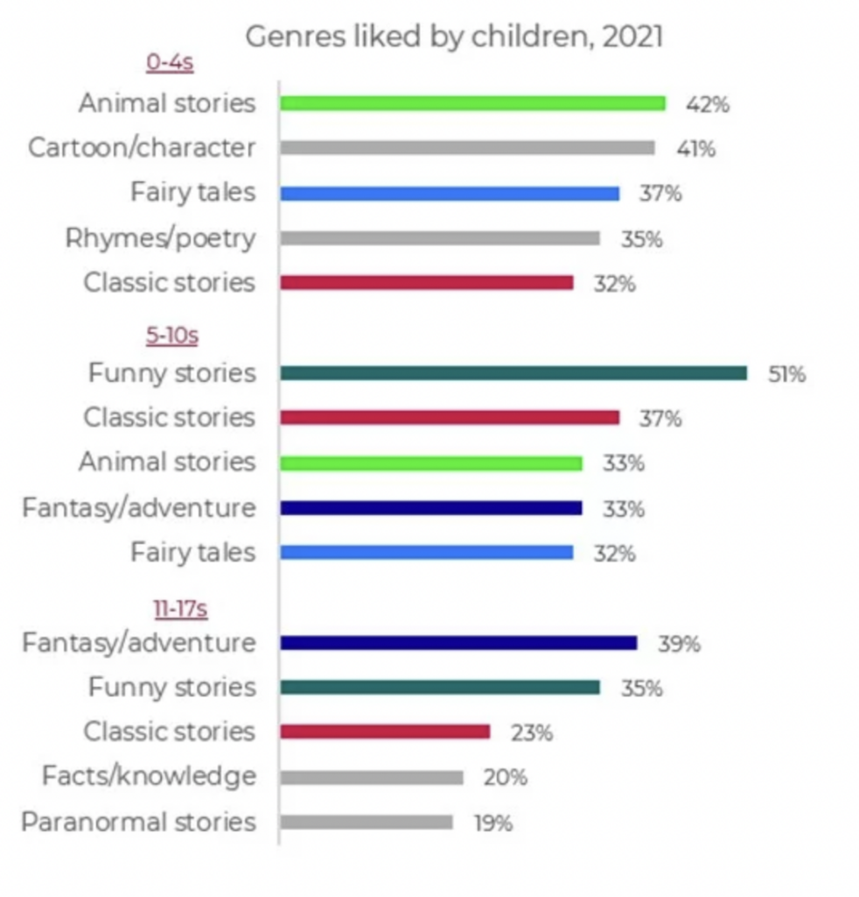

Замечали ли вы, что в книгах с картинками и книгах, предназначенных для двух-трехлетних детей, детское агентство представлено в виде говорящих животных? Говорящие животные - это отличный инструмент для объяснения перехода от несколько приближенного к животному существования к говорящему маленькому человеку.

<!--truncate-->

В книгах о животных, предназначенных для детей от одного до трех лет, обычно нет человеческого персонажа. Животные берут на себя роли людей и проявляют человекоподобное поведение - они разговаривают, готовят еду и едят за столом, гуляют, занимаются домашними делами, одеваются, ходят на горшок и т.д. Дети, в свою очередь, ассоциируют себя с животными и учатся человеческому поведению у животных-героев.

Однако со временем разум ребенка начинает различать людей и животных. Животные в детской литературе превращаются из главных героев в персонажей второго плана и в конце концов перестают говорить. Статистика, собранная в 2021 году компанией Neilsen Book Data, например, показывает большой интерес к историям о животных у детей от нуля до четырех лет. Постепенно интерес угасает, и дети от пяти до десяти лет отводят рассказам о животных четвертое место. Одиннадцати-шестнадцатилетние дети вообще не интересуются историями о животных.

В одной японской популярной художественной книге под названием Majo no takkyubin (Ведьмина Служба доставки) поднимается данный вопрос, когда появляется персонаж по имени Дзидзи. Это ведьмин кот. Ведьма по имени Кики могла разговаривать с ним, когда была маленькой, но к концу книги она обнаружила, что больше не слышит его слов. Ведьма стала старше, и канал связи с ее другом-животным закрылся.

Еще одно интересное наблюдение - сосуществование говорящих и неговорящих животных в одной книге. Например, в мире фэнтези есть говорящие животные и, да, еда, которую они едят. С одной стороны, поедание неговорящего животного не вызывает у читателя ощущения, что он сделал что-то плохое. Дети не ассоциируют еду с реально существующими животными до определенного возраста. С другой стороны, говорящее животное обычно воспринимается как персонаж младше главного героя. Дети обычно любят читать, опережая свой возраст. Десятилетние дети читают истории о двенадцатилетних героях и так далее. Говорящее животное в этом контексте переносит читателя в его юный возраст. Оно становится инструментом социального и нравственного воспитания.
